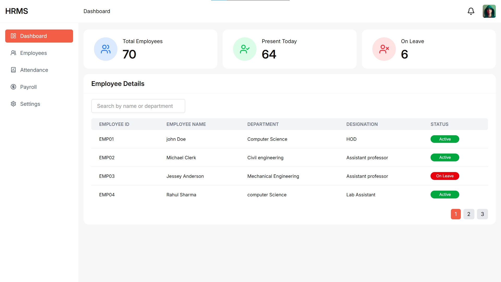
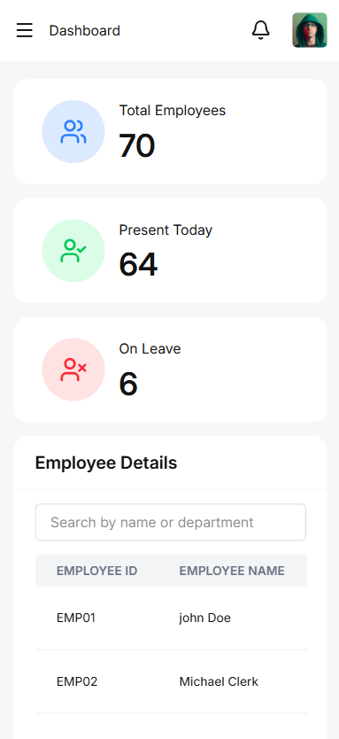
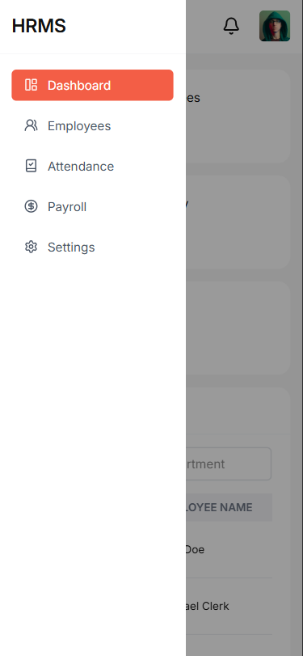
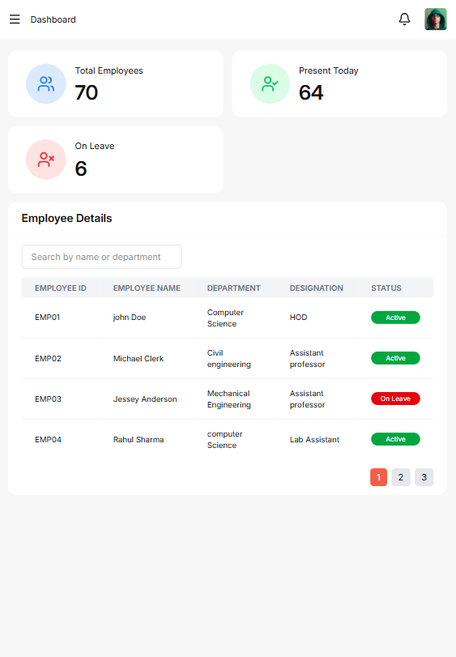

# College HRMS Dasboard UI

Responsive HRMS Dashboard for **SJCET Palai**

This project is a frontend UI implementation for a college HR department to manage 
employee data and view staff statistics.

----------------------------------------------------

# Tech Stack

- React (Vite)
- Tailwind CSS
- Functional Components + Hooks
- Js ES6+
- Responsive Design 

-----------------------------------------------------

# Folder Structure

## 📁 Project Structure

```
src/
│
├── components/
│   ├── dashboard/
│   │   ├── employee-table/
│   │   │   ├── EmployeeFilter.tsx
│   │   │   ├── EmployeeGrid.tsx
│   │   │   ├── EmployeePagination.tsx
│   │   │   └── EmployeeRow.tsx
│   │   │
│   │   ├── stats/
│   │   │   ├── Stats.tsx
│   │   │   └── StatsCard.tsx
│   │
│   ├── layout/
│   │   ├── Header.tsx
│   │   ├── Sidebar.tsx
│   │   └── MainLayout.tsx
│   │
│   ├── ui/
│   │   ├── Card.tsx
│   │   ├── IconButton.tsx
│   │   └── Input.tsx
│
├── data/
│   ├── employees.ts
│   └── stats.ts
│
├── pages/
│   └── DashboardPage.tsx
│
├── types/
│   └── types.ts
│
├── App.tsx
├── index.css
└── main.tsx
```

**1. Components/**<br/>
This folder contains all reusable components, organized based on their 
corresponding pages or functionality.

**2. data/**<br/>
This folder contains static JSON data

**3. pages/**<br/>
This folder contains the main page-level components that combine multiple 
related components to form complete views.

**4. types/**<br/>
This folder contains all TypeScript type definitions and interfaces used 
throughout the application.

**5. App.tsx**<br/>
Root component of the application. Defines main layout structure.

**6. main.tsx**<br/>
Mounts React app to the DOM.

**7. index.css**<br/>
contains global styles applied across the application. It integrates Tailwind CSS 
and includes the Google Font Inter for consistent typography.

------------------------------------------------

# Component Architecture

**1. layout/**<br/>
It contains structural components responsible for the overall page structure.

- Sidebar
Navigation menu (Dashboard, Employees, Attendance, Payroll, Settings).

- Header
Displays page title, notification icon, and profile icon

- Mainlayout
Wraps the entire application structure (Sidebar + Header + Main Content)

**2. dashboard/**<br/>
This folder contains components specific to the Dashboard page. devided into 2 sub folders.

**employee-table**<br/>
Displays employee records in a tabular format
* Pagination
* Basic search

**stats**<br/>
Contains 3 reusable statistic cards:
* Total employees
* Present today
* On leave

**3. Ui/**<br/>
This folder contains shared and reusable UI components.
* Card
* Icon button
* Input

-----------------------------------------------------------

# Setup 

1. Clone the repository

- git clone https://github.com/tibinjoseph30/college-hrms-dashboard.git


2. Install dependecies

- npm install


3. Run the project

- npm run dev


4. App will run on:

- http://localhost:5173

-------------------------------------------------------------

# Screenshots

### Desktop View


### Mobile View



### Tablet View


--------------------------------------------------------------

# Live Demo

- https://college-hrms.netlify.app/

-------------------------------------------------------------

# Author

Tibin Joseph<br/>
Frontent Developer


